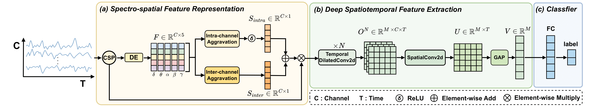

# SSF-DST

# Code for paper: SSF-DST: A Spectro-Spatial Features Enhanced Deep Spatiotemporal Network for EEG-Based Auditory Attention Detection

This paper introduces SSF-DST, a novel AAD network that efficiently enhances EEG spatial patterns using spectro-spatial features and captures long-term spatiotemporal dependencies.

Tong Zhu, Xiaoke Yang, Jian Zhou, Lu Li, Zhao Lv, Cunhang Fan. SSF-DST: A Spectro-Spatial Features Enhanced Deep Spatiotemporal
Network for EEG-Based Auditory Attention Detection. In Interspeech 2025.

# Preprocess
* Please download the AAD dataset for training.
* The public [KUL dataset](https://zenodo.org/records/4004271) and [DTU dataset](https://zenodo.org/record/1199011#.Yx6eHKRBxPa) are used in this paper.

# Requirements
+ Python3.9 \
`pip install -r requirements.txt`

# Run
* Modify the `getData` function in utils.py to match the dataset
* Using main.py to train and test the model

